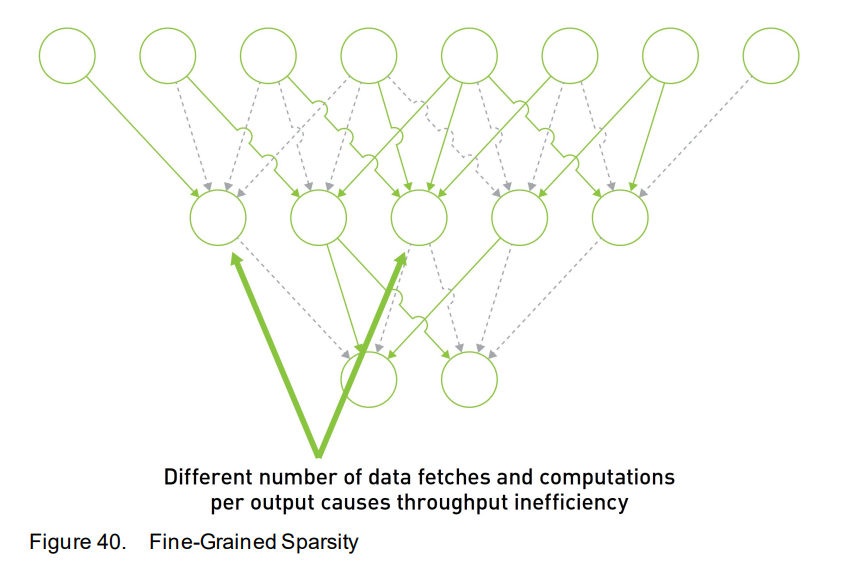
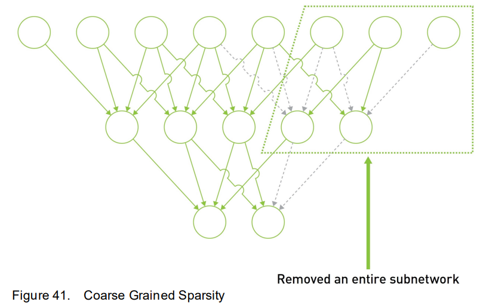
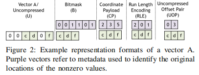

# Pruning and Sparsity
## What is Pruning and Sparsity?

## Sparsity patterns
Normally, the taxonomy of sparsity is diverse. However, I would like to list two frequently appearing categorization methods: Unstructrued/structured and fine/coarse-grained
### Structured/Unstructured Sparsity
- Sometimes, "fine-grained" and "unstructured" ("coarse-grained" and "structured") are confused. 
- Structured Sparsity does not just mean pruning a block from network, but means do pruning at a "block level".
- Pruning subnets do means structured sparsity, while some fine-grained sparsity methods are also structured. For instance, N:M sparsity is structured sparsity, for it pruning single values from a M size block. 

### fine-grained/Coarse-grained Sparsity
Categorize Sparsity by grain is intuitive. Fine-grained means several single weights are set to zero in the connection. as shown below (picture from *NVIDIA A100 Tensor Core GPU Architecture*, 2020, Appendix B):

The coarse-grained sparsity means set several neurons to zero as well as the sub-part of them. (picture from *NVIDIA A100 Tensor Core GPU Architecture*, 2020, Appendix B)

### How to Specify a Sparsity pattern?

## Hardware Co-design
* Of course original format of tensor can be used. However, there may be several methods to "ignore" zero values both in calculation and storage
### How to represent sparse tensor in accelerator?
- In sparse matrix, there are tons of zeros, which could consume both storage space and data access. Fortunately, there are several ways to store only non-zero values in tensor cores.
- *Representation format*, which is systematically described by Yannan Nellie Wu in 2022, means how to represent the location of non-zero values. (*Yannan Nellie Wu, 2022, section 3*). In that paper, *Representation format* is divided into 5 categories:

    

    1. *Uncompressed*: original vector without compression.
    2. *Coordinate Payload*: Use Coordinate to reperesent the position of non-zero values and use Payload to store the real non-zero values or pointer to next dimension.
    3. *Bitmask*: Compress data in a dense array and use a map with one bit values to represent the position of values.
    4. *Ren Length Encoding(RLE)*: Use multiple bits values to represent the distance between non-zero values.
    5. *Uncompressed Offset Pair*: Use multiple bits to represent the position of the start and end position of a series of zeros.

### How to avoid zeros in accelerator?
- *Gating and Skipping*, Only "ignore" zeros values is not enough. The operation on ineffectual operands should also be avoided. According to Yannan Nellie Wu's theory(*Yannan Nellie Wu, 2022, section 3*), There are two main methods:
    1. Gateing IneffOps
        1. Leader-follower intersection: Only check one operand. If the operand is zero, then keep the MAC idle. This may not detect all the ineffectual operations.
        2. Double-sided intersection: Detect both two operands. Either of them being zero could make the MAC stay idle. This could detect all the ineffectual operation, but may cause additional hardware overhead.
        - However, though the MAC is idle when encountering ineffectual, the caculation time is same as dense matrix. It could only reduce the power consumption.
    2. Skipping IneffOps 
        - The Skipping method totally skip the operation, when a ineffectual operand is detected, but not only stay idle. This method could also reduce the execute time.

# References
1. Y. N. Wu, P. -A. Tsai, A. Parashar, V. Sze and J. S. Emer, "Sparseloop: An Analytical, Energy-Focused Design Space Exploration Methodology for Sparse Tensor Accelerators," 2021 IEEE International Symposium on Performance Analysis of Systems and Software (ISPASS), Stony Brook, NY, USA, 2021, pp. 232-234, doi: 10.1109/ISPASS51385.2021.00043.