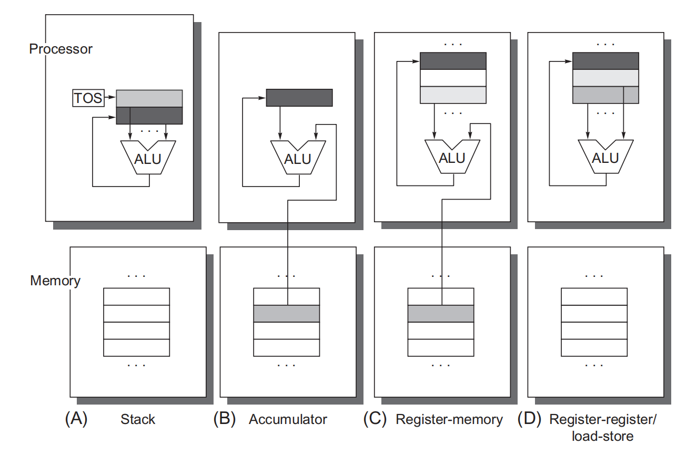
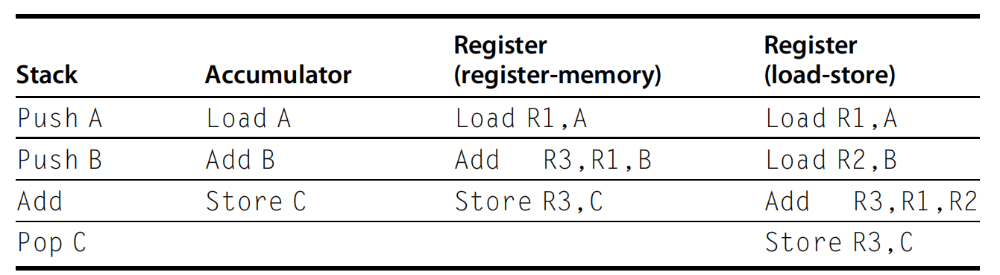

# Overview
This is a reading note based on [Computer Architecture, Sixth Edition: A Quantitative Approach](https://dl.acm.org/doi/book/10.5555/3207796)

## Architecture Classification
According to internal storage, there are three types of architectures: **stack architecture**, **accumulator architecture**, **general-purpose register architecture**. In stack and accumulator arch, at least one or more operands are implicit. operands of GPR are all explicit.

As shown above, if the memory is not accessed directly by instruction, it can only be accessed by load/store. There are three types of GPR, *register-memory, load-store, memory-memory*. There difference are mainly about the number of memory address and maximum number of operand allowed. As shown in below, the most commen load-store architecture only allows registers in ALU instructions.

