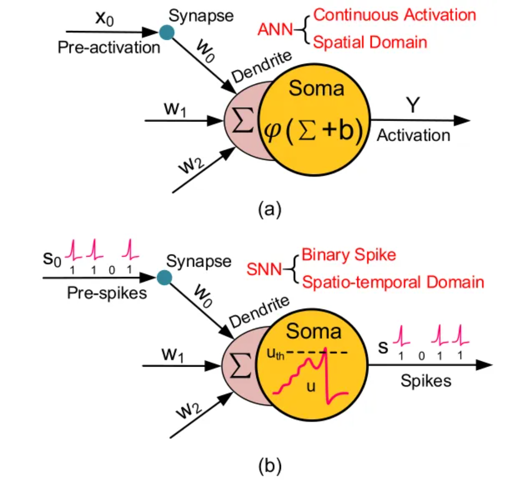
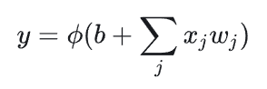
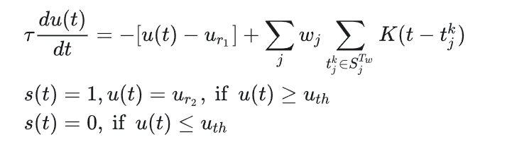

# N
## Definition 
- **Neuromorphic computer**: non-von Neumann computers whose structure and function are composed of neurons and synapses.

## Neuromorphic vs. von Neumann systems
### Different charactors
1. Processing/memory
    - Neuromorphic computers processgin and memory are governed by the neurons and synapses.
    - Von Neumann computers has seperate CPU and memory.
2. Programs dirver
    - In neuromorphic computer, programs are usually driven by the structure of neural network.
    - In von Neumann, programs are driven by instructions.
3. Data format
    - In neuromorphic data are in spikes.
    - In von Neumann, data are in binary.
### Operational different caused by characteristics
1. neuromorphic is inherently parallel.
2. neuromorphic has not data travel between memory and CPU.
3. neuromorphic are event driven
4. neuromorphic can include a notion os randomness.

## Neuromorphic algorithms and applications
