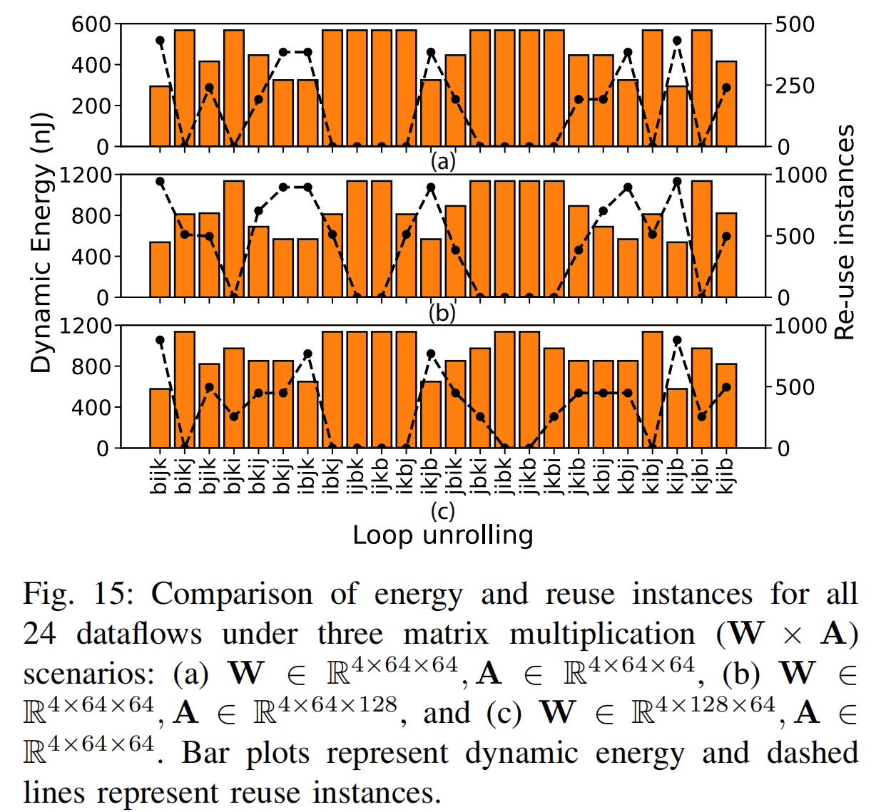
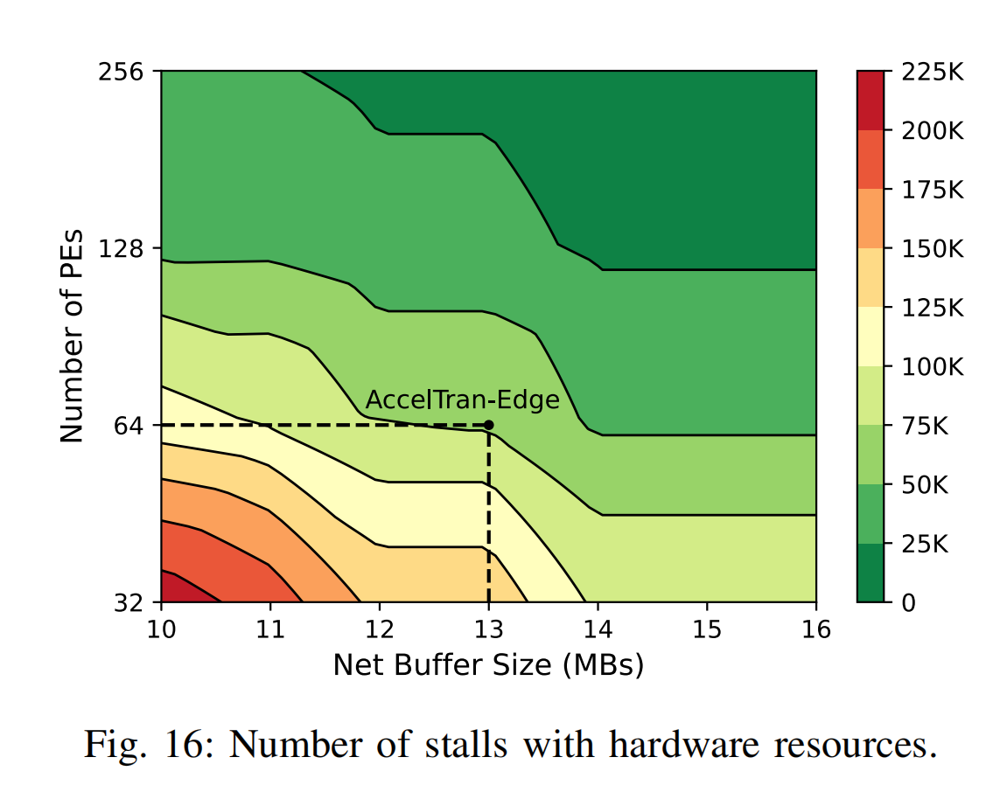

# [015][Transformer Accelerator][sparsity]AccelTran: A Sparsity-Aware Accelerator for Dynamic Inference with Transformers
## Overview
* Authors: Shikhar Tuli, Niraj K. Jha
* Affiliations: Princeton University
* Publication Venue: TCAD 2023
* Link: 
## Summary: 
### Problem:
1. Top k has a high compute overhead and need specific designed components
2. Previous work do not tile the matrix down or not tile the matrix according to data reuse.
### Key idea: 
- **DynaTran**: 
    1. determine spsarse ratio $\rho$ first and than calculte a threshhold 
    2. do pruning both on weight and activation.
- **AccelTran**: 
    1. Connect to 3D monolithic RRAM by driect memory access controller.
    2. use same comparator numbers as tile size to do pruning in parallel.
    3. use binary bit mask to store meta.
    4. both activation and weight has bitmask and use two input bit mask generate output bit mask and fetch data according to the output bit mask.
- **dataflow**:
    1. Test various dataflow to obtain the best one in preformance.

- Also use 3D RRAM

### Strengths:
1. The result is widely coverage.

The bandwidth and PE numbers are been considered according to stall. 
### weaknesses: 
2. threshold is pre-calculated, it is static during the matmul.
