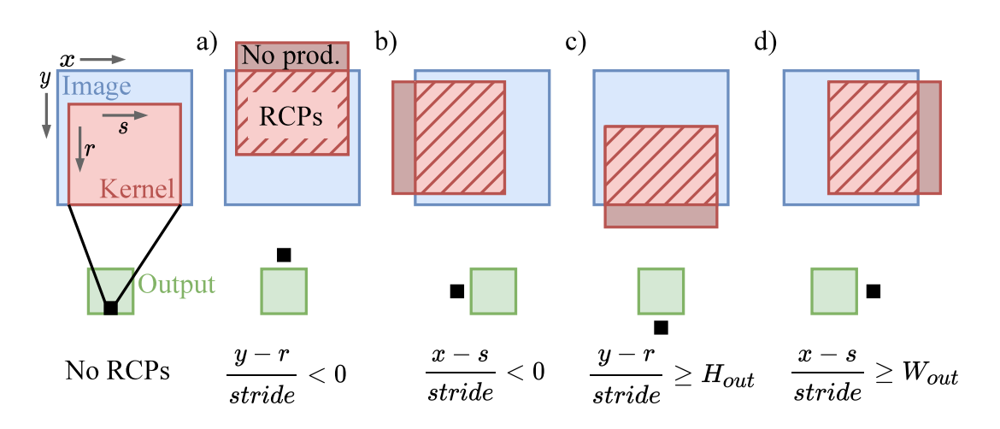

# [0xx][Training Accelerator]Anticipating and Eliminating Redundant Computations in Accelerated Sparse Training
## Overview
* Authors: Jonathan S. Lew, Yunpeng Liu, Tor M. Aamodt
* Affiliations: UBC
* Publication Venue: ISCA 2022
* Link: [https://doi.org/10.1145/3470496.3527404](https://doi.org/10.1145/3470496.3527404)
## Summary: 
### Problem:
- SOTA sparse training focus on exploiting sparsity on only one input to the convolution.
- The Redundent Cartesian Product(RCP) only matters in training. 
  - Trainig has gradient matrix multiplication which is large size.
  - Inference only have W A multiplication. W is small with less RCP.
### Key idea: 
- Taxonomy of sparse convolution accelerators
  - Inner-product
    - Expand each slide of the convolution kernel into a vector to do inner product multiplication(in2col), which create duplicate multiplications
    - Packing of the non-zero valuse is required to fill the multiplier array
  - Outer-product
    - The multiplication of all non-zero values are calculated.
    - Selet and accumulate the required products after multilication
    - Create Redundent Cartesian Products which only could not largely affect performance in inference or non-dynamic sparsity.
  - Intersection
    - Identify non-zero pairs before multiplication
    - The weight and activition sparse are both dynamic while training. The overhead of decompressing the indices lead to large overhead.
- ANT
  - The RCP appears when the kerna slide exceeds the boundaries of image. (terminology: kernal = weight, image = activition) 
  - Use indices relationship between output, image and kernal to detect the invalid product results.
  
  - Modeling the efficiency of Cartesian Products by  $\frac{H_{out}\times W_{out}}{H\times W_{out}}$
  - Because gradients have larger size, there are more ineffectual slides when doing Gradient * Activition
  - However, the ANT cannot ideally skip all the RCPs.
    - The hardware requires data to be sent in vector format.
    - The row/column contains both of RCPs and non-RCPs will be completely calculated.
    - Only when the whole row/column is RCPs, the RCPs could be skipped. 
- Architecture
  - ANT apply Compression Sparse Row as Compresion Format.
  - Indices range Computation module are added to avoid RCPs. 
  - Use CSR to get min and max position of data, to reduce data fetching.
  - Apply input stationary
  - Extend to Transformer is much more easier because the indices are explicit.
### Takeaways: 
- This methods actually is much more useful in DNN rather than in Transformer, because transformer even do not need to calculate Cortesian Product. The pair of values are static and explicit.
### Strengths: 
- Solve the problem introduced by SCNN (RCPs)
- Extremely hardware friendly in two side dynamic sparse training. 

