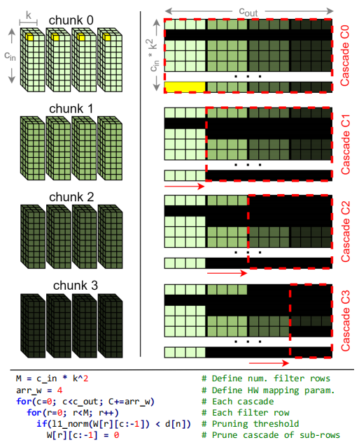

# [0xx][pruning algorithm]Cascading Structured Pruning: Enabling High Data Reuse for Sparse DNN Accelerators
## Overview
* Authors:Edward Hanson, Shiyu Li, Yiran Chen
* Affiliations: Duke University 
* Publication Venue: ISCA 2022
* Link: 
## Summary: 
### Problem:
- Existing weight sparsity only benefit data regularity but not inter PE reuse
- Activation sparse contains coomplex mechanisms such as content affressable memory to identify ineffectual activations.
- Large data buffer are usually required to store ineffectual activations.
- The improved performance of sparse tensor processong most come from sparse pattern instead of ratio.
- Each filter may have different pruning pixel coordinates which lead to the irregular re-fetching of activation  
### Key idea: 
- One filter kernel has $K\times K$ dimention, and each filter has $c_{in}$ channels, each weight has $c_{out}$ filters
    1. Flatten the kernel into 2 dimention matrix $k^2c_{in}\times c_{out}$. And divide $c_{out}$ into several chunks. 
    2. One cascade is defined as one chunk to chunk n
    3. Calculate the L1-norm of a sub-row in one cascade, compare with a threshlod. If ineffectual, prune the whole sub-row of the cascade.
    4. After pruning, fine-tuning is applied and regain the accuracy.

- weave compression
    - For the cascade pruning force the subrow to be successive.
    - The compression can use CSR without record the indices of column, instead, the paper recorded the number of chunks per row.
- Dataflow
    - Apply output stationary
    - use PEs in serial to avoid stall related papiline structure.
- Register bins
- **I totally cannot understand the usage and function of Register bins used in this paper under this pruning method. And I wouldn't spend much time on this paper. Maybe complete it later.**
### Takeaways: 
### Strengths: 
### weaknesses: 
### How can you do better: