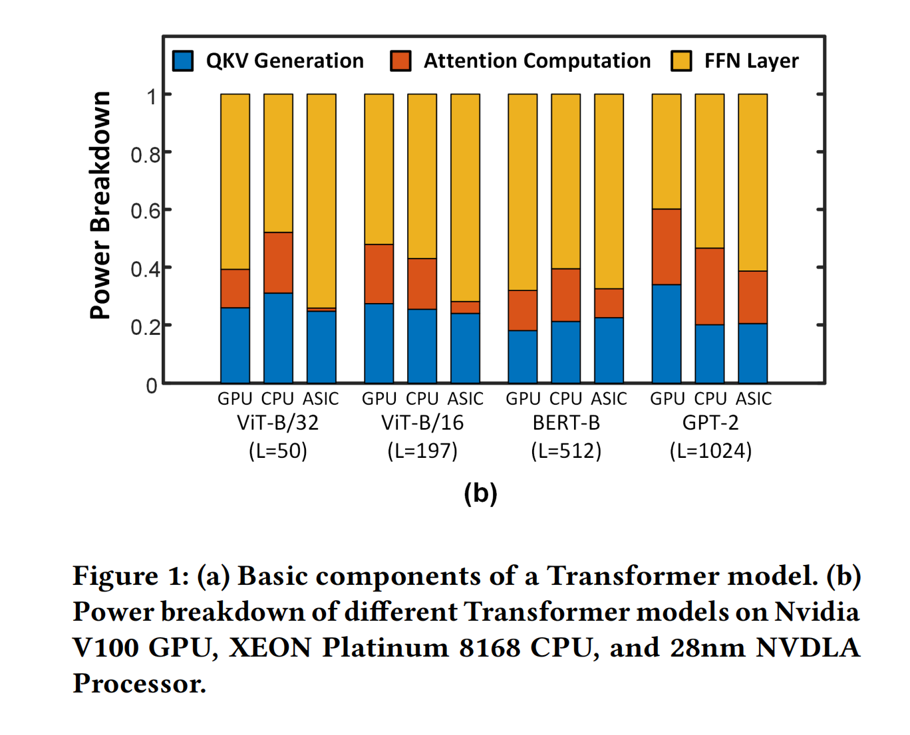
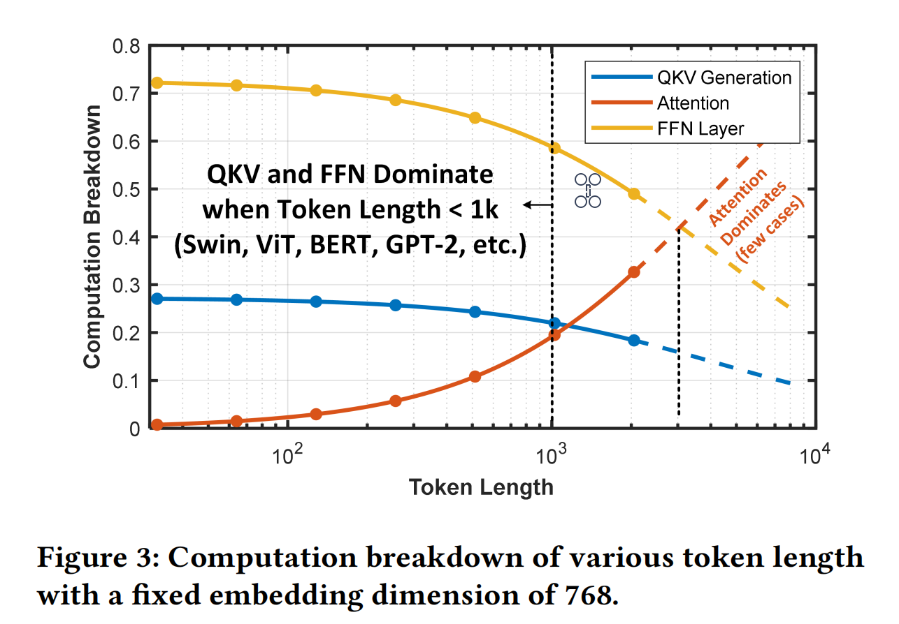

# [0xx][qkv generation sparsity] FACT: FFN-Attention Co-optimized Transformer Architecture with Eager Correlation Prediction
## Overview
* Authors: Yubin Qin
* Affiliations: Tsinghua University
* Publication Venue: ISCA 2023
* Link: [https://dl.acm.org/doi/abs/10.1145/3579371.3589057](https://dl.acm.org/doi/abs/10.1145/3579371.3589057)
## Summary: 
### Problem:
- The QKV generation and FFN layer dominates the computation overhead instead of attention computation, especially in short token computation. Hence the paper argues, the optimization is helpful, however the generation of QKV and FFN is compulsory.

- When token length is less than 1k, the QKV generation and FFN could dominate the overhead. However when token length over 3k, the attention computation overhead will increase sharply.

    - Most NLP Transformer have upper limit for token length.
    - Existing long sequence transformer already has optimization inside, which decrease the overhead of attention computation.
### Key idea: 
- Eager prediction mechanism: predict redundancy at the beginning of a layer to optimize QKV generation, attention computation and FFN at the same time.
    - Eager Correlation Prediction
        1. Predict $\widehat{Q},\widehat{K}$ by transforms the data into log-domain, 
            - $$\alpha = Sign\times 2^{(W-LO-1)}\times M$$
            - $$\alpha\times\beta = XOR(Sign_{\alpha},Sign_{\beta})\times 2^{W_{\alpha}+W_{\beta}-(LO_{\alpha}+LO_{\beta}-2)}\times (M_{\alpha}\times M_{\beta})$$
            - The relation shape between $\alpha, \beta$ can be approximated by the sum of LO
            - That means omit the mantissa, use leading one zeros position to predict the relationship between matmul results.
            -  "In our experiment, using the first “1” (a.k.a. leading one) can achieve over 90% hit rate for predicting the top-k result of the 𝐴 matrix."
        2. Apply the same prediction pattern to A=QK
        3. Apply row wise top-k to A
        4. predict K V sparse mask by observe A
        5. Compare the difference between 1st and 2nd value of each row with a threshold. If the former is larger, then consider the row is important and keep this query.
        6. Use the k% which is the key selected ratio of top-k to evaluate the importance of the token. If r*L*h*k% is larger than a threshold, the FFN of this token is computed in full quantization, vice versa.

### Takeaways: 
- I have already observed that Dense MatMul(that is QKV generation) in our work could take a large latency and energy overhead. The problem indeed exist.
- 
### Strengths: 
- FACT is the first work that explicitly accelerates QKV generation, FFN and attention computation at same time in Transformer model.
### weaknesses: 
- Ac
### How can you do better:
### Comments
