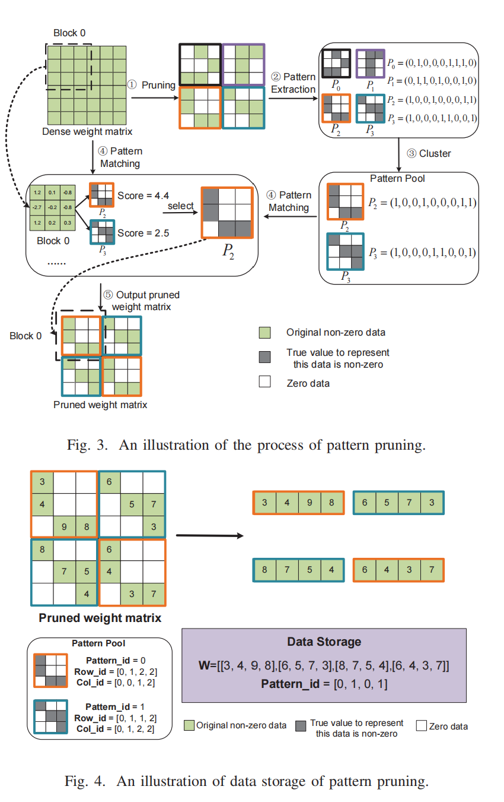

# [0xx][pattern pruning]
## Overview
* Authors: Jialin Cao, Kun Wang
* Affiliations: Fudan University
* Publication Venue: ICCAD 2023
* Link: [https://ieeexplore.ieee.org/abstract/document/10323836](https://ieeexplore.ieee.org/abstract/document/10323836)
## Summary: 
### Problem:
1. Conventional structured pruning have either severe loss in accuracy(coarse grained pruning), or large consumtion in index storage(especially fine-grained like N:M).

### Key idea: 
- Pattern pruning
    1. weight matrix blocks are first pruned to required sparsity
    2. Cluster all block sparse patterns into several limited patterns
    3. Calculate matching degree of blocks with selected patterns, and determine which pattern to use.
- Storage format
    - Pattern pool: selected patterns with *pattern id*, *row* and *col*
    - weight matrix: Weight after pruning with *data* and *pattern id*
    
- Hardware
    - Apply weight stationary in systolic array, and use ping-pong weight buffer to hide the latency of weight selection.

### Takeaways: 
- The index compression/decompression is a problem in sparse matrix. If data are stored in a simple compressed method, the hardware overhead could be reduced.
- The result in SPADA shows that most SpGeMM matrix matmul non-zero distribution could appear repeatedly in an area. May pattern pruning make sense in some general matrix application.

### weaknesses:
- Ping-Pong buffer and selection logic doubled the hardware overhead. This work orientating in edge device. Additional hardware and energy overhead is unacceptable.
- The accuracy drop sharply while the block size increase. This only work under a small block size.

