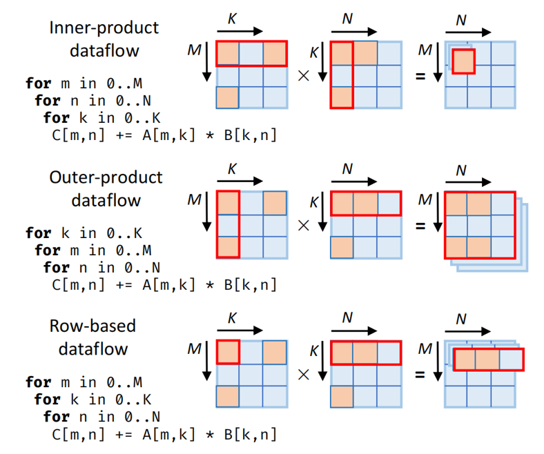
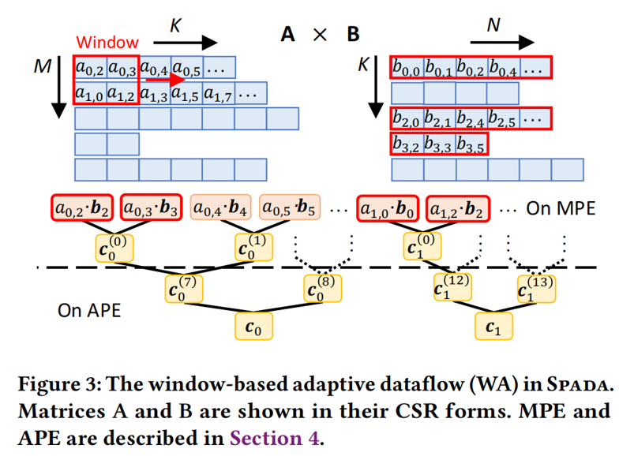
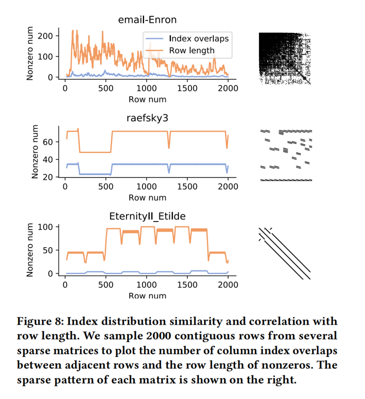

# [0xx][MatMul Accelerator] Spada: Accelerating Sparse Matrix Multiplication with Adaptive Dataflow
## Overview
* Authors: Zhiyao Li, Jiaxiang Li, Mingyu Gao
* Affiliations: Tsinghua University
* Publication Venue: ASPLOS 2023
* Link: [https://doi.org/10.1145/3575693.3575706](https://doi.org/10.1145/3575693.3575706)
## Summary: 
### Background
- Sparse Matrix multiplication appears in several fields.
  - In ML, after pruning and activation funtion, the matrix will become sparse.
- In previous research, people proposed several methods to optimize MatMul
  - For sparse MatMul, there are three kind of dataflows which is most applied.

  - 4 differences
    - in/out Reuse
    - coordinate intersection
    - granularity
    - Compress Encoding(CSC,CSR)
### Problem:
- Highly irregular structures
- Because SpGEMM is applied in various application domains, the accelerators need to support diverse sparse patterns. 
- Recent research only support SpGEMM to support a certain sparsuty ranges to best utilize their architecture. Core reason is the fixed dataflow in the optimizzation of MatMul.
### Key idea: 
- Window-based adaptive dataflow(WA)
  - split whole matrix into sub-blocks. Apply row-wise dataflow inter 
  - Fetch a 2x2 window from CSR arrays of Matric A each time. Fetch coresspongding value arrays from B in CSR format. This time, arrays in B (b2)could be reused.

 

- SPADA Hardware architecture
  + Accelerator contain MPEs(Multiplication Process Element) and APEs(Accumulation Process Element)
  + 8 multiplier lanes in each MPE to match the window size α x β = 8
  + Each lane has a B fetcher, a P queue
    * P queue: Ensure the output inter lanes is the smallest two, to make sure the result of each group could  be merged correctly
    * B fetcher fetch correct b matrix rows
  + Each pair of lanes use a sort array for load balance
    * Use shared sort array to change the sent bk to make sure the indices gap of a pair of multiplier is small enough to let the lanes work smoothly. When b is not fullfilled, also could balance the empty lanes.
  + All lanes connected to a final bitonic network and a flexible reduction tree
    * Bitonic Network sort the output column indices of P queue inner group using bitonic sorter
    * Flexible Reduction Tree merge and reduce the products to partial output $C_m(t)$

- Window shape adaption
  + The reuse pattern could be determined by the distribution overlap of column indices. The distribution of matric whithin windows are similiar.
  + Within a local matrix region, use the profiling performance results on the first few rows to determine the optimized window shape for the following rows

### Takeaways: 
- The idea of predict distribution is smart.
- However the adjust of window size seems make no large difference on performance.
### Strengths: 
- The idea that make architecute to adjust the data distribution dynamically make accelerator flexible
### weaknesses: 
- The data distribution prediction highly rely on the experience but not fit to randomly distribution.
### How can you do better:
