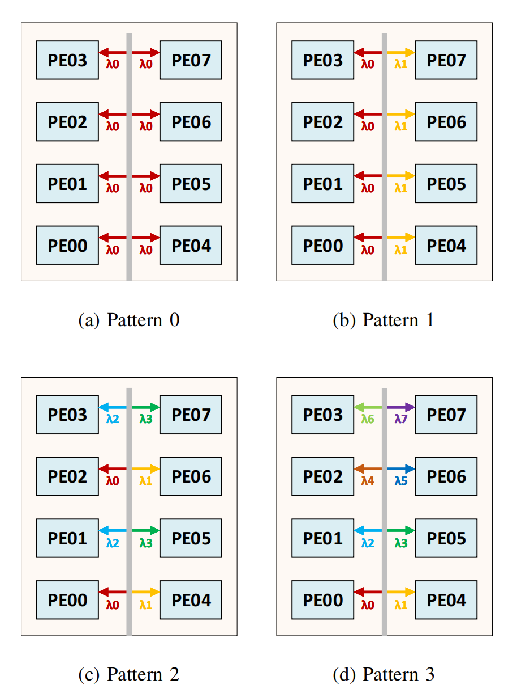
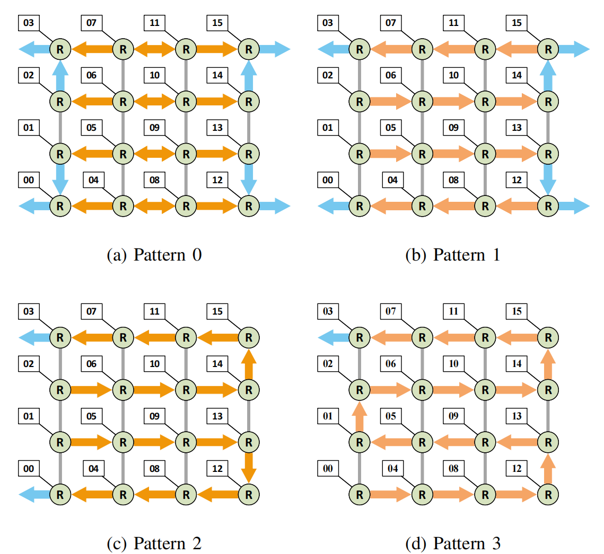

# [0xx][photonic][accelerator] HPPI: A High-Performance Photonic Interconnect Design for Chiplet-Based DNN Accelerators
## Overview
* Authors: Guanglong Li, Yaoyao Ye
* Affiliations: Shanghai Jiaotong University
* Publication Venue: TCAD 2023
* Link: [10.1109/TCAD.2023.3328828](10.1109/TCAD.2023.3328828)
## Summary: 
### Problem:
1. Non-uniform latency and bandwidth between intra-chiplet and inter-chiplet cause latency variablity across chiplet.
2. Long distance between chiplet cause additional communication energy/time consumption.
3. Statically designed fixed broadcast communication would not work efficiently in all DNN layers.

### Background
1. Photonic Interconnect
	* MRR is used to build optical link. And WDM broaden then bandwidth largely.
	* Multicast and Broadcast are implemented by applying tunable splitter.
2. Chiplet-based DNN Accelerator
	* Limitation of SOTA conventional chiplet: 
		+ Simba: long-distance inter-chiplet communication and the non-uniform communication latency.
		+ NN-Baton: the ring topology and crossbar limited the scalibility of the system.
		+ NOI: The off-package bandwidth is limited by the central deployed memory controller.
	* Limitation of SOTA photonic interconnect:
		+ SPRINT: Contention between unicast and broadcast limited the performance.
		+ ASCEND: feature map size and structure mismatch limited the ultilization of computing resources.

### Key idea:
- Reconfigurable communication pattern
	+ Each communication pattern has different number of destination PE.
	+ The number of channels and output pixels could be adjusted by change the communication pattern.

- Use photonic connection between memory/buffer and inter chiplet. Use eletronic NoC inner chiplet.
- pattern prediction model
	- A clear correlation appears between parameter proportion and the optimal choice of communication pattern.
	- regression model could be trained to predict the optimal parameters.

### Takeaways: 
- Applying this method to structured sparsity to achieve different block size may be interesting.
### Weakness:
- The number of communication pattern is $log_2^(N)+1$. The increase of PE numbers will increase the complexity of the prediction model.

