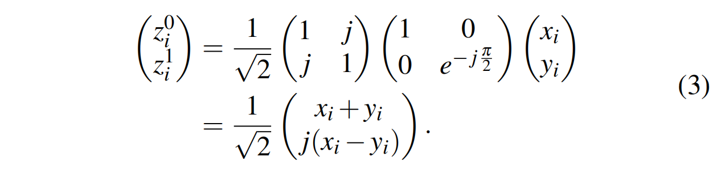
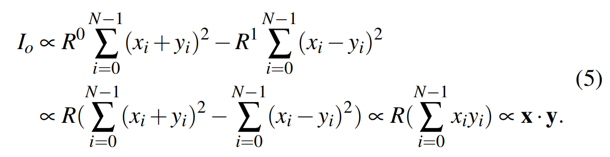
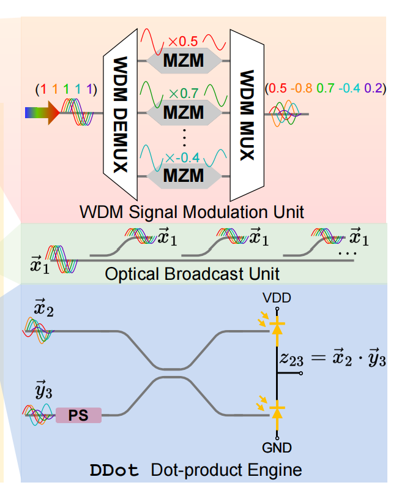

# [0xx][photonic compute][coherent] Lightening-Transformer: A Dynamically-operated Optically-interconnected Photonic Transformer Accelerator
## Overview
* Authors: Hanqing Zhu, Jiaqi Gu, Song Han
* Affiliations: Texas Austin, MIT
* Publication Venue: HPCA 2024
* Link: [https://arxiv.org/abs/2305.19533](https://arxiv.org/abs/2305.19533)
## Summary: 
### Problem:
- Previous Research
    - Traditional accelerator based on digital eletronics face limit of Dennard scaling
    - Photonic computing alternatives like MZI array, MRR banks and PCM(Phase Change Material)-based crossbar only designed and optimized for weight-static NNs. They fail to efficiently support attention-based transformers.
- Challenges for transformer accelerators
    1. Transformers have MatMul with two dynamic input operands.
        - Previous photonic accelerators map one operand on device by program the device, which consumes time.
    2. Transformer matmul are in full range 
        - Previous incoherent PTC such as MRR constrained at least one operand to be non-negative.
        - Negative operands have to be decomposed into differences of non-negative operands which introduce additional accumulation.
- Key insight
    1. Mapping and device programming can dominate total latency for WS PTCs whose overhead can not be easily amortized
        - Optically encode both operands for dynamic switching.
    2. Incoherent PTCs use weighted light intensities to do multiplication which make supporting full-range matmul difficult.
        - Encode signs to extra phase dimension and perform signed computation via interference.

### Key idea: 
- DDot
    - Apply directional coupler, this device could convert two vector into :

    - The photocurrent is proportional to the square intensities of WDM signal.
    - Apply balanced photodetection, get the subtraction between two output photocurrent:
    - The output signal has format of x*y.

    - By apply the MZM(Mach-Zehnder modulator) which output is $E_{out} = E_{in}cos\theta$, the output can range from [-1,1]
- DPTC
    - Maximum intra-core operand sharing to reduce operand modulation cost.
    - First DEMUX WDM signal, send them into MZM with different $\theta$. Then MUX output of MZMs again to get a WDM signal which has several x value in one waveguide.

- Evaluation part: analyse the WDM dispersion and optical encoding noise 

### Strengths: 
- This idea solved the problems in operands restriction and device pogramming.
- The taxonomy is clear.
- The analyse of inperfection elements is clear.
- The simulator is open-source
- Though no background in photonics, still good to read

### weaknesses: 
- Can only be applied on OS 
- This idea is already proposed early in 2022 nature.
- The mathematical part of this work is mainly on proportional relationship. 

### How can you do better:
- I'm thinking about whethner it is possible to build up a simulator especially for inperfection evaluation in photonic interconnect and computation. Though mathematical derivation is available, I'm thinking that whether there is other methods to be more near to realistic situation?

### Takeaway in paper:
- PTC-Level Takeaways
    1. Exploring both spectral and spatial parallelism of optics brings significant performance.
    2. Dynamic full-range operand encoding enables versatility.
    3. Leveraging the natural broadcast capability of optics maximizes hardware sharing and energy efficiency.
- Architecture-Level Takeaways
    1. Combining photonic computing with photonic interconnect unleashes the power of optics.
    2. Offloading more computing to the analog domain relaxes the A/D conversion bottleneck
    
### Comments
